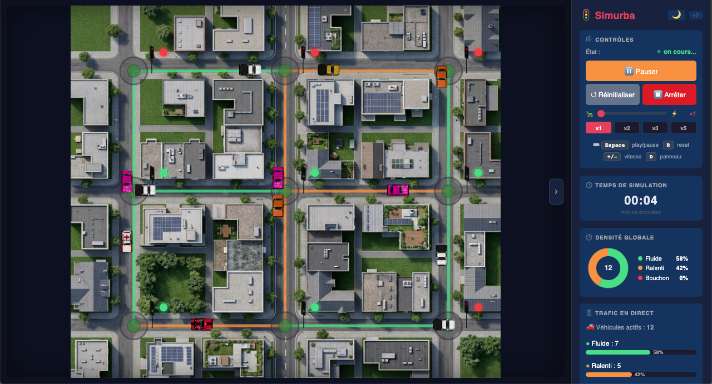
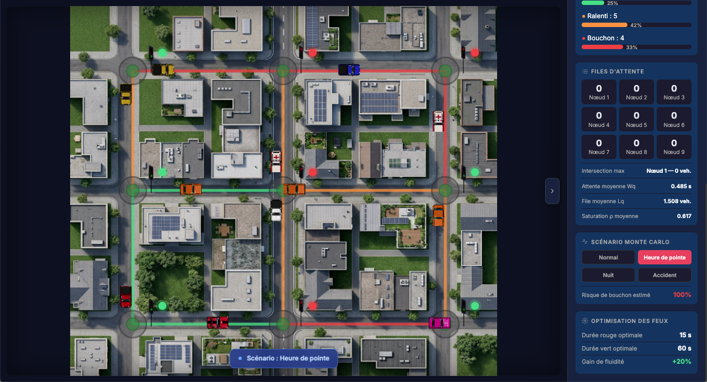
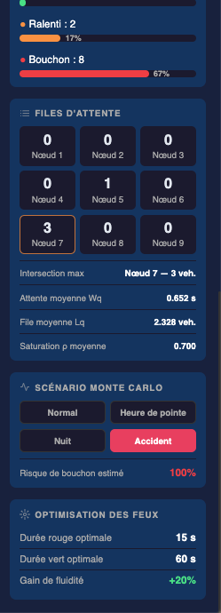

# Simurba — Simulateur de Trafic Urbain

> Projet Final — Modélisation Stochastique — L2 Informatique  
> Simulation interactive du trafic urbain intégrant des modèles mathématiques (chaînes de Markov, files d'attente M/M/1, Monte Carlo) et une interface web dynamique construite avec Django.

---

## Apercu du projet



*Scenario : Nuit — trafic tres fluide, risque de bouchon estime a 19 %*



*Scenario : Heure de pointe — risque de bouchon estime a 100 %, saturation visible sur le reseau*



*Panneau de droite : densite globale, files d'attente par noeud, metriques M/M/1*

---

## Table des matieres

- [Presentation](#presentation)
- [Architecture du projet](#architecture-du-projet)
- [Modeles mathematiques integres](#modeles-mathematiques-integres)
- [Prerequis](#prerequis)
- [Installation et lancement (interface web Django)](#installation-et-lancement-interface-web-django)
- [Lancement de l'interface desktop (PySide6)](#lancement-de-linterface-desktop-pyside6)
- [Structure des fichiers](#structure-des-fichiers)
- [API interne](#api-interne)
- [Deploiement sur Vercel](#deploiement-sur-vercel)
- [Auteur](#auteur)

---

## Presentation

**Simurba** (Simulation Urbaine) est une application de simulation de trafic urbain developpée dans le cadre du projet final du cours de Modelisation Stochastique (L2 Informatique — ESTI).

L'objectif est de repondre aux questions suivantes :

- Pourquoi y a-t-il des embouteillages ?
- Comment evolue l'etat du trafic dans le temps ?
- Comment optimiser la duree des feux tricolores pour reduire la congestion ?

Le projet combine une **interface web interactive** (Django + JavaScript) et une **interface desktop** (PySide6), toutes deux pilotees par les memes modules mathematiques Python.

---

## Architecture du projet

```
Donnees (scenarios Monte Carlo)
       |
       |
Chaines de Markov  -->  etat de chaque route (fluide / ralenti / bouchon)
       |
       |
Files d'attente M/M/1  -->  metriques : Wq, Lq, rho
       |
       |
Optimisation  -->  durees optimales des feux (rouge / vert)
       |
       |
Interface (Django web ou PySide6 desktop)  -->  visualisation en temps reel
```

---

## Modeles mathematiques integres

### Chaines de Markov

Chaque route du reseau est modelisee comme un processus de Markov a trois etats : **Fluide**, **Ralenti**, **Bouchon**. A chaque tick de simulation, l'etat de chaque route evolue selon une matrice de transition dont les probabilites dependent du scenario actif (normal, heure de pointe, nuit, accident).

Exemple de matrice pour le scenario **Normal** :

|          | Fluide | Ralenti | Bouchon |
|----------|--------|---------|---------|
| Fluide   | 0.85   | 0.12    | 0.03    |
| Ralenti  | 0.20   | 0.65    | 0.15    |
| Bouchon  | 0.10   | 0.25    | 0.65    |

### Files d'attente M/M/1

Chaque intersection est modelisee comme une file d'attente M/M/1, avec :

- **lambda (λ)** : taux d'arrivee des vehicules (depend de l'etat Markov)
- **mu (μ)** : taux de service fixe a 5 vehicules par tick
- **rho (ρ) = λ/μ** : taux de saturation (doit etre < 1 pour la stabilite)

Les metriques calculees en temps reel :

- **Wq** : temps moyen d'attente dans la file
- **Lq** : nombre moyen de vehicules en attente
- **ρ** : taux de saturation moyen

### Simulation Monte Carlo

Chaque scenario (Normal, Heure de pointe, Nuit, Accident) definit une distribution de probabilites sur les etats initiaux des routes. A chaque changement de scenario, les etats sont tires aleatoirement selon ces distributions, produisant un reseau dont la configuration initiale est realiste et differente a chaque execution.

### Optimisation des feux tricolores

Un module d'optimisation par recherche exhaustive teste toutes les combinaisons (duree rouge, duree verte) dans la plage [15 s — 60 s] et selectionne la paire qui minimise le temps d'attente moyen sur l'ensemble du reseau. Le gain de fluidite compare a la configuration par defaut (30 s / 30 s) est affiche en pourcentage.

---

## Prerequis

- Python **3.10** ou superieur
- `pip` (gestionnaire de paquets Python)
- (Optionnel pour PySide6) un environnement graphique (Linux avec X11/Wayland, macOS ou Windows)

Verification de la version Python :

```bash
python --version
# ou
python3 --version
```

---

## Installation et lancement (interface web Django)

### 1. Cloner le depot

```bash
git clone https://github.com/<votre-utilisateur>/simurba.git
cd simurba
```

### 2. Creer et activer un environnement virtuel

**Linux / macOS :**

```bash
python3 -m venv venv
source venv/bin/activate
```

**Windows :**

```bash
python -m venv venv
venv\Scripts\activate
```

### 3. Installer les dependances

```bash
pip install -r requirements.txt
```

Le fichier `requirements.txt` contient :

```
Django==5.2.12
numpy>=1.26
asgiref==3.8.1
sqlparse==0.5.3
whitenoise==6.7.0
```

### 4. Appliquer les migrations

```bash
python manage.py migrate
```

### 5. Lancer le serveur de developpement

```bash
python manage.py runserver
```

### 6. Ouvrir l'application

Ouvrir un navigateur et aller a l'adresse :

```
http://127.0.0.1:8000
```

La simulation demarre automatiquement. La carte se met a jour toutes les 2 secondes via des appels API internes.

---

## Lancement de l'interface desktop (PySide6)

L'interface PySide6 est une version autonome qui n'utilise pas Django. Elle utilise les memes modules mathematiques (`traffic/markov.py`, `traffic/queue_model.py`, etc.).

### Prerequis supplementaires

```bash
pip install PySide6
```

### Lancement

Depuis la racine du projet :

```bash
python pyside/main.py
```

> Remarque : PySide6 necessite un environnement graphique. Sur un serveur distant sans affichage, utilisez l'interface web Django.

---

## Structure des fichiers

```
simurba/
|
|-- config/                    # Configuration Django (settings, urls, wsgi, asgi)
|   |-- settings.py
|   |-- urls.py
|   `-- ...
|
|-- traffic/                   # Application principale
|   |-- markov.py              # Chaines de Markov — matrices de transition par scenario
|   |-- queue_model.py         # Files d'attente M/M/1 — calcul de Wq, Lq, rho
|   |-- monte_carlo.py         # Scenarios Monte Carlo — distributions initiales
|   |-- optimizer.py           # Optimisation des feux tricolores par recherche exhaustive
|   |-- views.py               # Vues Django (page principale + endpoints API)
|   |-- urls.py                # Routage des URLs (/, /api/tick/, /api/scenario/, /api/stats/)
|   |-- models.py              # Modeles de base de donnees (minimal)
|   |-- templates/
|   |   `-- traffic/base.html  # Template HTML principal de la simulation
|   `-- static/
|       `-- traffic/js/
|           `-- simulation.js  # Logique JavaScript : animation, appels API, rendu carte
|
|-- pyside/
|   `-- main.py                # Interface desktop autonome (PySide6)
|
|-- api/
|   `-- index.py               # Point d'entree pour le deploiement Vercel
|
|-- manage.py                  # Point d'entree Django standard
|-- requirements.txt           # Dependances Python
|-- vercel.json                # Configuration de deploiement Vercel
`-- db.sqlite3                 # Base de donnees SQLite (generee automatiquement)
```

---

## API interne

L'interface web communique avec le backend Django via trois endpoints JSON :

| Endpoint | Methode | Description |
|---|---|---|
| `/api/tick/` | GET | Calcule un nouveau tick : applique Markov sur toutes les routes, retourne les etats mis a jour |
| `/api/scenario/` | POST | Change le scenario actif (normal / heure_de_pointe / nuit / accident) et reinitialise les etats Monte Carlo |
| `/api/stats/` | GET | Retourne les metriques M/M/1 completes (Wq, Lq, rho) et les resultats d'optimisation des feux |

Exemple de reponse de `/api/stats/` :

```json
{
  "wq_moyen": 0.283,
  "lq_moyen": 0.914,
  "rho_moyen": 0.517,
  "files_noeuds": [0, 0, 0, 6, 0, 0, 3, 0, 0],
  "intersection_max": { "noeud": 4, "file": 6 },
  "optimisation": {
    "duree_rouge": 15,
    "duree_vert": 60,
    "gain_fluidite": 20
  }
}
```

---

## Deploiement sur Vercel

Le projet est configure pour un deploiement direct sur [Vercel](https://vercel.com) via le fichier `vercel.json`.

### Etapes

1. Creer un compte sur vercel.com
2. Installer la CLI Vercel :

```bash
npm install -g vercel
```

3. Depuis la racine du projet :

```bash
vercel
```

Suivre les instructions interactives. Vercel detecte automatiquement la configuration via `vercel.json` et `api/index.py`.

> Le fichier `api/index.py` expose l'application WSGI Django comme une fonction serverless compatible Vercel.

---

## Fonctionnalites de l'interface

- **Carte animee** : reseau de 9 intersections avec vehicules en mouvement colores selon leur etat (vert = fluide, orange = ralenti, rouge = bouchon)
- **Controles** : play / pause, reinitialiser, vitesse de simulation (x1, x2, x3, x5)
- **Scenarios Monte Carlo** : Normal, Heure de pointe, Nuit, Accident — chaque scenario modifie les matrices de Markov et les etats initiaux
- **Tableau de bord en temps reel** : densite globale, trafic en direct, files d'attente par noeud, metriques M/M/1, risque de bouchon estime, optimisation des feux
- **Mode sombre** integre (theme par defaut)

---

## Auteur

Projet realise dans le cadre du cours de **Modelisation Stochastique — L2 Informatique**  
Etablissement : **ESTI**  
Annee universitaire : **2025 — 2026**
